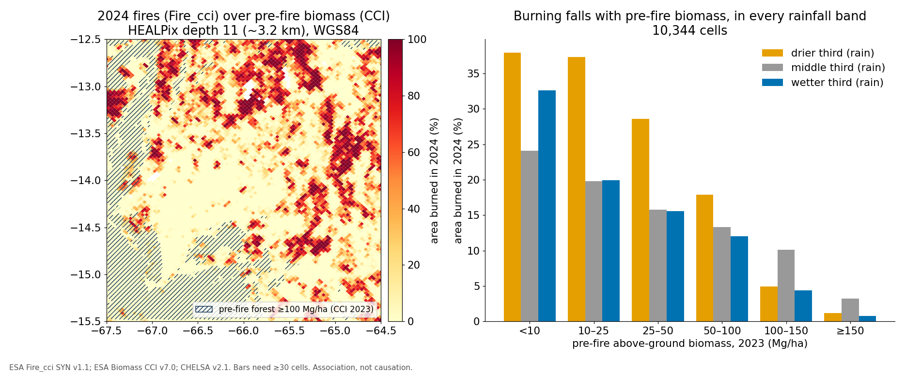

# beni-fire-biomass-healpix

> **The Global Extent and Determinants of Savanna and Forest as Alternative Biome States** — replication study.
>
> Reference paper: [10.1126/science.1210465](https://doi.org/10.1126/science.1210465)

Staver, Archibald & Levin (2011) found that at intermediate rainfall (1000–2500 mm) tree cover is bimodal and only fire separates savanna from forest. This repository revisits that claim at a regional scale: the **Beni savanna–forest mosaic of Bolivia**, one of the ecosystems the paper's argument is about.

**Question.** Within comparable rainfall, does the share of land that burned in 2024 fall as pre-fire above-ground biomass rises?

**Data.** Three open products are put on one grid — [HEALPix](https://healpix.jpl.nasa.gov/) depth 11 on the WGS84 ellipsoid (about 3 km cells) via [`healpix-connector`](https://doi.org/10.5281/zenodo.22904851):

- ESA CCI Biomass v7.0: above-ground biomass for 2023, the year before the fires.
- ESA Fire_cci SYN v1.1: burned area for 2024.
- CHELSA bio12: mean annual precipitation.

**Headline result** (10,344 cells):

| Pre-fire biomass (Mg/ha) | <10 | 10–25 | 25–50 | 50–100 | 100–150 | ≥150 |
|---|---|---|---|---|---|---|
| Mean share burned in 2024 | 32.1% | 27.3% | 19.7% | 13.6% | 5.6% | 1.4% |

- Burned share falls with biomass overall (Spearman ρ = −0.38).
- It also falls within each rainfall tercile (ρ = −0.23, −0.24, −0.39), so rainfall alone does not explain the pattern.
- 99% of cells lie inside the paper's 1000–2500 mm band.
- Biomass is strongly skewed (bimodality coefficient 0.72), which is consistent with, but not proof of, two alternative states.



**Verdict: partially supported.** This is one region and one fire year, and the result is an association. It cannot tell "fire keeps biomass low" apart from "low-biomass land burns more", so it supports the fire–biomass link the paper describes but does not test the mechanism. The full reasoning is in the [FORRT nanopublication chain](nanopubs/README.md).

It produces:

- A reproducible computational pipeline (Snakefile + notebooks).
- A FORRT-tagged nanopublication chain on the [Science Live platform](https://platform.sciencelive4all.org), documenting the claim, the replication design, and the outcome with full provenance.
- A Zenodo-archived release (source + container image) with a citable DOI.

## Quick start

```bash
git clone https://github.com/annefou/beni-fire-biomass-healpix.git
cd beni-fire-biomass-healpix
pixi install
pixi run snakemake --cores 1
```

Or with Docker:

```bash
docker run --rm ghcr.io/annefou/beni-fire-biomass-healpix:latest
```

## Structure

- `paper/` — the source paper PDF (drop yours in there).
- `notebooks/` — jupytext `.py` notebooks that drive the pipeline.
- `data/` — raw inputs (~1.2 GB) are downloaded by `notebooks/01_data_download.py` and not committed; the per-cell table `data/clean/beni_cells.parquet` is committed so CI can re-run the analysis.
- `nanopubs/` — drafts of the FORRT chain field-by-field, plus the published-URI registry.
- `docs/` — operating manuals (FORRT form fields, chain decision tree, claim-type vocabulary).
- `figures/` — curated figures used in the Jupyter Book.

## Nanopublication chain

The published chain is listed in [`nanopubs/PUBLISHED.md`](nanopubs/PUBLISHED.md). Each step links to its viewer URL on the Science Live platform.

## Citation

If you use this work, please cite both:

- This software: [`CITATION.cff`](CITATION.cff) → DOI [{{ZENODO_DOI}}]({{ZENODO_DOI}}).
- The original paper: [10.1126/science.1210465](https://doi.org/10.1126/science.1210465).
